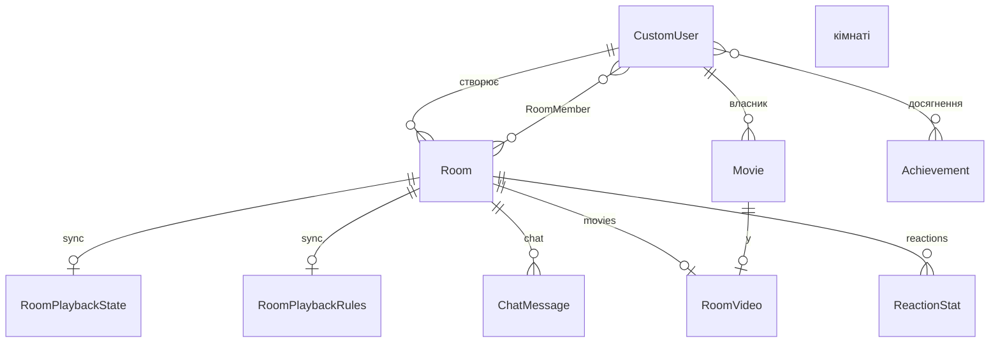

# Cinema — діаграма бази даних

## Компактна (для скріншота в звіт)

Файл: [`database-uml-compact.puml`](./database-uml-compact.puml) — **10 сутностей**, без списку полів.



Експорт PNG: [mermaid.live](https://mermaid.live) або PlantUML → `database-uml-compact.puml`.

---

## Розширена (усі 15 моделей)

Діаграма відповідає моделям Django у проєкті `backend/cinema`. Файл: [`database-uml.puml`](./database-uml.puml).

## Mermaid повна (для звіту / GitHub / draw.io імпорт)

```mermaid
erDiagram
    CustomUser ||--o{ Room : "creator"
    CustomUser ||--o{ RoomMember : "member"
    Room ||--o{ RoomMember : "has"

    CustomUser ||--o{ RoomAuthorizedController : "authorized"
    CustomUser ||--o{ ChatMessage : "writes"
    CustomUser ||--o{ Movie : "owner"
    CustomUser ||--o{ ViewingHistory : "watches"
    CustomUser ||--o{ UserAchievement : "earned"
    CustomUser ||--o{ Friendship : "user"
    CustomUser ||--o{ Friendship : "friend"

    Movie ||--o{ RoomVideo : "attached"
    Movie ||--o{ ViewingHistory : "tracked"
    Achievement ||--o{ UserAchievement : "granted"

    Room ||--o| RoomPlaybackState : "room_id UUID"
    Room ||--o| RoomPlaybackRules : "room_id UUID"
    Room ||--o{ RoomAuthorizedController : "room_id UUID"
    Room ||--o{ ChatMessage : "room_id UUID"
    Room ||--o| RoomVideo : "room_id UUID"
    Room ||--o{ ReactionStat : "room_id UUID"
    Room ||--o{ ViewingHistory : "room_id optional"

    CustomUser {
        bigint id PK
        string username
        string email UK
        string password
        image avatar
        text bio
        bool is_pro
        string display_name
    }

    Room {
        uuid id PK
        string name
        fk creator_id
        datetime created_at
        bool is_active
        bool is_public
        string invite_code UK
    }

    RoomMember {
        bigint id PK
        fk room_id
        fk user_id
        datetime joined_at
    }

    RoomPlaybackState {
        bigint id PK
        uuid room_id UK
        float current_time
        bool is_playing
        datetime updated_at
    }

    RoomPlaybackRules {
        bigint id PK
        uuid room_id UK
        bool anyone_can_control
        datetime updated_at
    }

    RoomAuthorizedController {
        bigint id PK
        uuid room_id
        fk user_id
        datetime granted_at
    }

    ChatMessage {
        bigint id PK
        uuid room_id
        fk user_id
        text text
        datetime created_at
    }

    Movie {
        uuid id PK
        string title
        text description
        string video_type
        file video_file
        url youtube_url
        image poster
        fk owner_id
        datetime created_at
    }

    RoomVideo {
        bigint id PK
        uuid room_id UK
        fk movie_id
        string creator_name
        string room_name
        string invite_code
        bool is_public
    }

    ReactionStat {
        bigint id PK
        uuid room_id
        string emoji
        int count
    }

    ViewingHistory {
        bigint id PK
        fk user_id
        fk movie_id
        uuid room_id
        int watched_seconds
        datetime watched_at
    }

    Friendship {
        bigint id PK
        fk user_id
        fk friend_id
        string status
        datetime created_at
    }

    Achievement {
        bigint id PK
        string name
        string key UK
        string description
        string icon
    }

    UserAchievement {
        bigint id PK
        fk user_id
        fk achievement_id
        datetime earned_at
    }
```

## PlantUML (повна UML з пакетами)

Файл: [`database-uml.puml`](./database-uml.puml)

**Як отримати PNG/PDF для звіту:**

1. [plantuml.com/plantuml](https://www.plantuml.com/plantuml/uml/) — вставити вміст `.puml`
2. VS Code / Cursor: розширення **PlantUML** → Preview → Export
3. CLI: `java -jar plantuml.jar docs/database-uml.puml`

## Легенда

| Тип зв’язку | Пояснення |
|-------------|-----------|
| **Суцільна лінія (FK)** | `ForeignKey` у Django (`Room.creator`, `ChatMessage.user`, …) |
| **Пунктир / room_id** | Логічний зв’язок через `UUIDField` без FK (плагіни sync, chat, reactions) |

## Модулі

| Пакет | Моделі |
|-------|--------|
| `apps.users` | CustomUser |
| `apps.rooms` | Room, RoomMember |
| `plugins.sync` | RoomPlaybackState, RoomPlaybackRules, RoomAuthorizedController |
| `plugins.chat` | ChatMessage |
| `plugins.movies` | Movie, RoomVideo |
| `plugins.reactions` | ReactionStat |
| `plugins.activity` | ViewingHistory |
| `plugins.social` | Friendship |
| `plugins.achievements` | Achievement, UserAchievement |

**Всього: 15 сутностей.**
